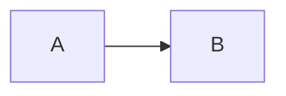

# HTML Renderer Guide

Generate clean HTML output from Markdown with syntax highlighting and custom styling.

## Basic Usage

```swift
import SwiftMarkdownParser

let parser = SwiftMarkdownParser()
let html = try await parser.parseToHTML("# Hello **World**")
```

## Custom Context

```swift
let context = RenderContext(
    baseURL: URL(string: "https://example.com"),
    sanitizeHTML: true,
    styleConfiguration: StyleConfiguration(
        cssClasses: [
            .heading: "custom-heading",
            .paragraph: "content-text",
            .codeBlock: "highlight"
        ]
    )
)

let html = try await parser.parseToHTML(markdown, context: context)
```

## Syntax Highlighting

HTML renderer includes automatic syntax highlighting for:
- JavaScript, TypeScript, Swift, Kotlin, Python, Bash

```swift
let codeMarkdown = """
```swift  
let parser = SwiftMarkdownParser()
```
"""

let html = try await parser.parseToHTML(codeMarkdown)
// Returns HTML with syntax highlighting CSS classes
```

## Mermaid Diagrams

```swift  
let diagramMarkdown = """

"""

let html = try await parser.parseToHTML(diagramMarkdown)
// Includes Mermaid diagram integration
``` 