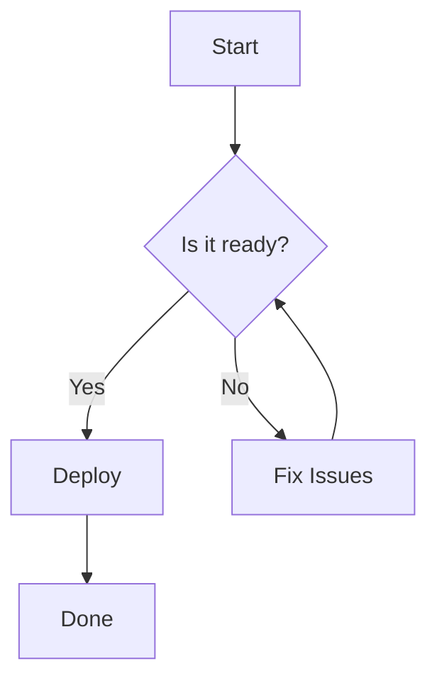
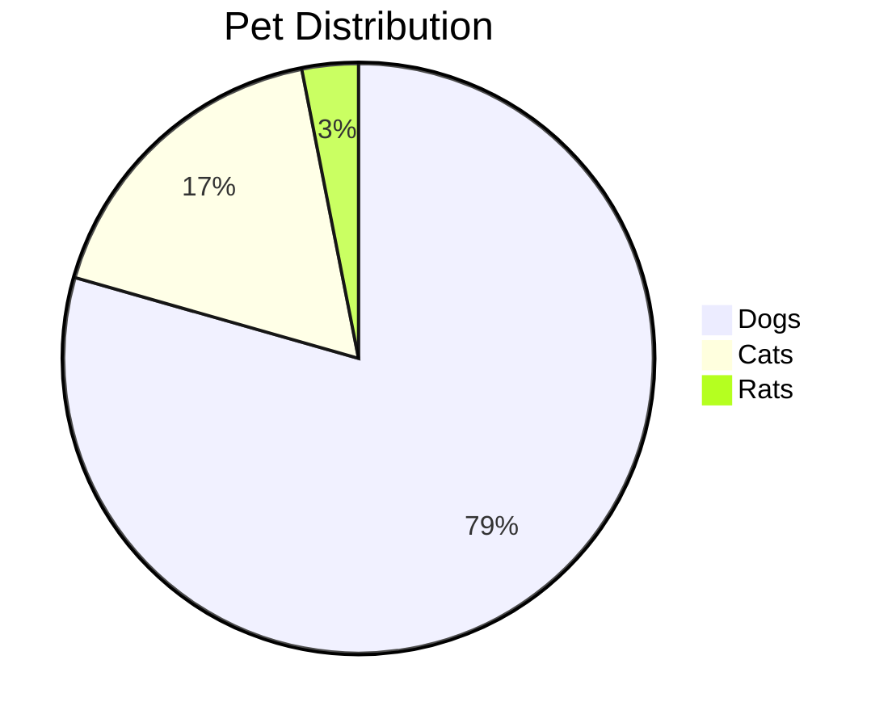

# Mermaid Diagrams Guide

Create interactive charts and diagrams in Markdown using [Mermaid](https://mermaid.js.org/) syntax.

## Supported Diagram Types

- **Flowcharts**: `graph`, `flowchart`
- **Sequence Diagrams**: `sequenceDiagram` 
- **Class Diagrams**: `classDiagram`
- **State Diagrams**: `stateDiagram`
- **Gantt Charts**: `gantt`
- **Pie Charts**: `pie`
- **Entity Relationship**: `erDiagram`
- **User Journey**: `journey`
- **Git Graph**: `gitGraph`

## Basic Usage

````markdown

````

## HTML Rendering

```swift
let markdown = """

"""

let parser = SwiftMarkdownParser()
let html = try await parser.parseToHTML(markdown)
```

## SwiftUI Integration

```swift
import SwiftUI
import SwiftMarkdownParser

struct ContentView: View {
    let markdown = """
    # Document with Diagram
    
    ```mermaid
    graph LR
        A[Input] --> B[Process]
        B --> C[Output]
    ```
    """
    
    @State private var content: AnyView?
    
    var body: some View {
        Group {
            if let content = content {
                ScrollView {
                    content.padding()
                }
            } else {
                ProgressView("Loading...")
            }
        }
        .task {
            await loadContent()
        }
    }
    
    private func loadContent() async {
        do {
            let parser = SwiftMarkdownParser()
            let ast = try await parser.parseToAST(markdown)
            let renderer = SwiftUIRenderer()
            self.content = try await renderer.render(document: ast)
        } catch {
            await MainActor.run {
                self.content = AnyView(Text("Error loading content"))
            }
        }
    }
}
```

## Configuration

```swift
// Custom Mermaid themes and settings
let config = MermaidConfiguration(
    theme: .dark,
    securityLevel: .strict
)

let context = RenderContext(mermaidConfiguration: config)
let html = try await parser.parseToHTML(markdown, context: context)
```