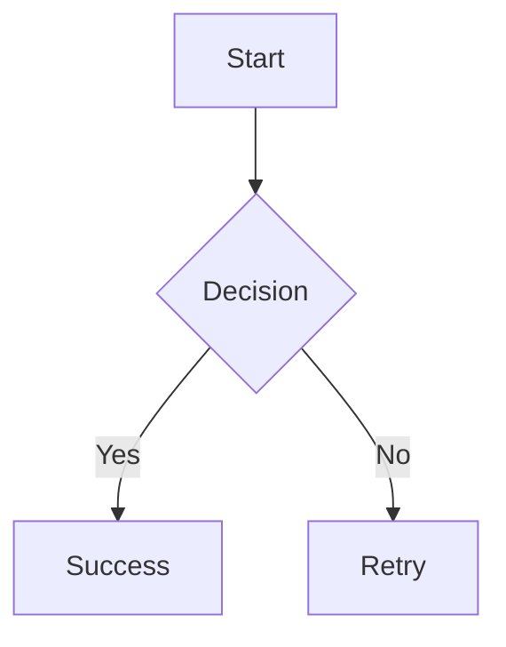

# SwiftMarkdownParser

[](https://github.com/sciasxp/SwiftMarkdownParser/actions/workflows/ci.yml)
[](https://swift.org)
[](https://developer.apple.com/ios/)
[](https://developer.apple.com/macos/)
[](https://swift.org/package-manager/)
[](https://opensource.org/licenses/MIT)

A Swift-native Markdown parser with AST generation, HTML rendering, and SwiftUI support. Built for Swift 6 with async/await and zero dependencies.

## Features

- **CommonMark 0.30** compliant with **GitHub Flavored Markdown** extensions
- **HTML rendering** with syntax highlighting for 6+ programming languages  
- **SwiftUI rendering** for native iOS/macOS apps (requires iOS 17.0+/macOS 14.0+)
- **AST generation** for custom processing and analysis
- **Zero dependencies** - pure Swift implementation
- **Async/await** support with Swift 6 concurrency
- **Mermaid diagram** support for both HTML and SwiftUI output

## Requirements

- **Swift 6.0+**
- **iOS 17.0+** (SwiftUI renderer) or **iOS 13.0+** (HTML only)
- **macOS 14.0+** (SwiftUI renderer) or **macOS 10.15+** (HTML only)

## Installation

Add to your `Package.swift`:

```swift
dependencies: [
    .package(url: "https://github.com/sciasxp/SwiftMarkdownParser.git", from: "1.0.0")
]
```

## Quick Start

### HTML Rendering

```swift
import SwiftMarkdownParser

let markdown = """
# Hello World
This is **bold** and *italic* text with a [link](https://swift.org).

- [x] Completed task
- [ ] Pending task

```swift
print("Hello, World!")
```
"""

let parser = SwiftMarkdownParser()
let html = try await parser.parseToHTML(markdown)
print(html)
```

### SwiftUI Integration

```swift
import SwiftUI
import SwiftMarkdownParser

struct MarkdownView: View {
    let markdown: String
    @State private var renderedView: AnyView?
    
    var body: some View {
        Group {
            if let view = renderedView {
                view
            } else {
                ProgressView("Loading...")
            }
        }
        .task {
            await renderMarkdown()
        }
    }
    
    private func renderMarkdown() async {
        do {
            let parser = SwiftMarkdownParser()
            let ast = try await parser.parseToAST(markdown)
            
            let renderer = SwiftUIRenderer()
            let view = try await renderer.render(document: ast)
            
            await MainActor.run {
                self.renderedView = view
            }
        } catch {
            await MainActor.run {
                self.renderedView = AnyView(Text("Error: \(error.localizedDescription)"))
            }
        }
    }
}
```

### Working with the AST

```swift
import SwiftMarkdownParser

let parser = SwiftMarkdownParser()
let ast = try await parser.parseToAST(markdown)

// Analyze the AST structure
func analyzeMarkdown(_ node: ASTNode) {
    switch node {
    case let heading as AST.HeadingNode:
        print("Heading Level \(heading.level)")
    case let link as AST.LinkNode:
        print("Link to: \(link.url)")
    case let codeBlock as AST.CodeBlockNode:
        print("Code block (\(codeBlock.language ?? "plain"))")
    case let table as AST.GFMTableNode:
        print("Table with \(table.rows.count) rows")
    default:
        break
    }
    
    for child in node.children {
        analyzeMarkdown(child)
    }
}

analyzeMarkdown(ast)
```

### Syntax Highlighting

HTML renderer includes syntax highlighting for JavaScript, TypeScript, Swift, Kotlin, Python, and Bash:

```swift
let codeMarkdown = """
```swift
let parser = SwiftMarkdownParser()
let html = try await parser.parseToHTML("# Hello")
```
"""

let parser = SwiftMarkdownParser()
let html = try await parser.parseToHTML(codeMarkdown)
// Returns HTML with syntax highlighting applied
```

### Custom Configuration

```swift
// Parser configuration
let config = SwiftMarkdownParser.Configuration(
    enableGFMExtensions: true,
    strictMode: false,
    maxNestingDepth: 100,
    trackSourceLocations: false,
    maxParsingTime: 30.0
)

let parser = SwiftMarkdownParser(configuration: config)
```

### Mermaid Diagrams

Both HTML and SwiftUI renderers support Mermaid diagrams:

```swift
let diagramMarkdown = """

"""

let parser = SwiftMarkdownParser()
let html = try await parser.parseToHTML(diagramMarkdown)
// HTML output includes embedded Mermaid diagram
```

## API Reference

### Core Classes

- `SwiftMarkdownParser` - Main parser class
- `SwiftMarkdownParser.Configuration` - Parser configuration options
- `HTMLRenderer` - Renders AST to HTML with syntax highlighting  
- `SwiftUIRenderer` - Renders AST to SwiftUI views (iOS 17.0+/macOS 14.0+)

### Main Methods

```swift
// Parse to AST
func parseToAST(_ markdown: String) async throws -> AST.DocumentNode

// Parse directly to HTML  
func parseToHTML(_ markdown: String, context: RenderContext = RenderContext()) async throws -> String

// Render AST with custom renderer
func render(document: AST.DocumentNode) async throws -> Output
```

## Documentation

- See [`Examples/`](Examples/) directory for complete working examples
- Check [`Tests/`](Tests/) directory for comprehensive usage patterns  
- Review [`CONTRIBUTING.md`](CONTRIBUTING.md) for development guidelines

## Testing

```bash
swift test
```

## Contributing

1. Fork the repository
2. Create a feature branch
3. Make your changes and add tests
4. Submit a pull request

## License

MIT License - see [LICENSE](LICENSE) file for details. 